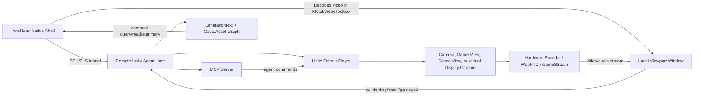

# Remote Unity Shell: Streaming, Editor Windows, And No-Editor Rendering

Status: **experimental**. Every measured result below is historical evidence tied to its recorded date, Editor version, and platform. Nothing here proves Unity 7 or Windows support.

Last reviewed: 2026-08-26.

Remaining work and open gates are tracked as GitHub issues: https://github.com/rankupgames/unity-cursor-toolkit/issues

## 1. Goal And Constraints

Build a VS Code Remote SSH-style experience for Unity. The local Mac keeps a native-feeling shell. Unity processing, project files, asset indexing, builds, tests, and rendering run on a remote workstation or VM. Inside that shell the viewport shows the *real* Unity editor windows: Scene View with its actual toolbar, gizmos, handles, and tools; Game View; Inspector; Package Manager; and any custom `EditorWindow`. Unity runs invisibly and the extension owns its lifecycle.

This is not only screen sharing. Three planes must work together:

- Control plane: commands, sessions, auth, project lifecycle, test/build/debug.
- Context plane: `.umetacontext`, asset graph, code graph, package state, scene and prefab summaries.
- Render/input plane: low-latency video and audio, plus pointer, key, touch, gamepad, and semantic Unity commands.

### The honest constraint

| Want | Possible? | How |
| --- | --- | --- |
| Real Scene View pixels and controls in Cursor | Yes | Capture the live `SceneView` surface in-process; inject input as editor `Event`s |
| Unity window not visible anywhere | Yes | Run the full editor (not `-batchmode`), hide the app, let the extension own the lifecycle |
| Unity process not running at all, but Scene View renders | **No** | Scene View, Inspector, and Package Manager *are* the editor. No process, no windows |
| Game view without the editor | Yes | Player build streaming. Game content only, no editor surfaces |

So "close Unity" means the extension launches Unity itself, hidden, when a panel starts. The editor process still exists. It is the render farm.

Why the editor process is the floor: `UnityEngine.*` and `UnityEditor*` assemblies are thin managed wrappers, and nearly every method that touches rendering, objects, assets, or windows is `[MethodImpl(MethodImplOptions.InternalCall)]`. The editor binary registers those internal calls ("icalls") during boot, so loading the managed DLLs in your own .NET or Mono host gives metadata and pure-managed code only, then dead-ends at the first icall. Unity ships one supported embedding, Unity as a Library, and it embeds the *player* runtime, which has no SceneView, Inspector, or AssetDatabase. So anything "without Unity running" must either not be the real editor, or hide and automate the editor so it feels absent.

### Capture approaches, compared

| Approach | Fidelity | Works hidden? | Works in `-batchmode`? | Input path | Verdict |
| --- | --- | --- | --- | --- | --- |
| A. Camera re-render (v0) | Camera image only; no toolbar, gizmos, handles, overlay UI | Yes | Yes | Synthetic Input System events | Headless fallback |
| B. `GUIView.GrabPixels` per EditorWindow (internal API, reflection) | Pixel-exact real window, IMGUI and UIElements chrome included | Yes; windows render to their own surfaces, we force `Repaint` | No; no GUIViews exist | `EditorWindow.SendEvent(Event)`, in-process, no OS focus | **Primary path** |
| C. OS window capture (ScreenCaptureKit, Windows Graphics Capture, FFmpeg `gdigrab`) | Pixel-exact, GPU-cheap, 60fps | Partly; hidden apps can stop compositing, a virtual display helps on Windows | No | OS-level events; focus fights with Cursor | Remote-host lane |
| D. Rebuild panels natively from MCP data | Not pixels; our UI, Unity data | Yes | Yes | Direct tool calls | Long-term complement |

The pick is B, with A as the batch fallback and C as the remote lane. Every `EditorWindow` has an internal `m_Parent` (`HostView : GUIView`), and `GUIView.GrabPixels(RenderTexture, Rect)` blits the view's actual backbuffer. It works while the app is hidden because we drive `Repaint()` ourselves. The risk is internal API drift between Unity versions; the permanent spike in section 4 catches that. B is in-process editor code, so the spike must also pass on Windows editor hosts.

Accepted fidelity gaps: `GenericMenu` and some dropdowns are native OS menus and are not capturable; IME and text composition do not work (plain keystrokes do); OS drag-and-drop needs `DragAndDrop` synthesis; mouse cursor shapes are not transmitted.

## 2. Architecture



VS Code Remote Development keeps the client UI local and runs a server on the remote OS. Unity uses the same pattern with an extra render plane. The Unity Agent Host is the VS Code Server equivalent: MCP server, Unity command bridge, context graph, and render streamer. Port forwarding maps to the viewport stream, profiler stream, editor bridge, and app preview ports. The local app must not bulk-sync the project. It asks for compact context, runs commands near the project, and fetches only narrow files or assets.

### Remote host modes

| Mode | Use | Rendering viability |
| --- | --- | --- |
| Unity Editor `-batchmode -executeMethod` | automation, commands, tests, controlled capture | Viable if graphics are initialized. Do not use `-nographics` for rendered capture |
| Unity Editor visible or headless session | richer editor tooling and editor windows | Viable, depends on display and session availability |
| Unity Player build | game/device viewport streaming | Best fit for stable low-latency streaming |
| Dedicated Server build | simulation and server authority | Not a viewport source; Unity optimizes away render and audio work |
| Windows VM with a virtual display driver | one virtual monitor per shell session | Strong fit for Sunshine/Moonlight or custom desktop capture |
| macOS remote host | capture app, window, or display via ScreenCaptureKit | Viable, subject to macOS permissions |

`-batchmode` suits automation, but `-nographics` skips graphics device initialization, so it is only valid for non-rendering work. Batchmode also limits `WaitForEndOfFrame`, so capture loops must use explicit camera or render texture capture, or player builds.

### Transport options

| Transport | Fit | Notes |
| --- | --- | --- |
| MJPEG over local HTTP | debug and prototype | Easy to inspect, high bandwidth, no real input or audio protocol |
| Unity Render Streaming / WebRTC | Unity-native interactive stream | Video, audio, and remote control on WebRTC. v1 candidate |
| Sunshine plus Moonlight | low-latency desktop or app streaming | Proven GPU-encoded path; pairs well with virtual displays |
| RDP RemoteApp / RAIL | seamless remote app metaphor | Reference model for per-window local integration |
| Custom stream over WebRTC, QUIC, or RTP | long-term control | Combines low-latency media with Unity-specific metadata and input |

Direction: keep MJPEG as the debug transport; add WebRTC for camera and render texture streams with input data channels; keep Sunshine/Moonlight as a parallel whole-display lane; build the local shell as a semantic controller, not a video player.

### Protocol shape

- `viewport_stream` carries a `target`: `scene`, `game`, `inspector`, `packageManager`, or `window:<type>`. Sessions are multi-keyed.
- Frames travel in-band as `"data": "<base64 jpeg>"` on `viewportFrame`. This removes the same-filesystem assumption and makes the stream remote-ready.
- Input is a typed event union routed to the session window: `{kind: move|down|up|drag|wheel|key|char, x, y, dx, dy, button, modifiers, key, char}`. Coordinates are normalized 0..1 against the streamed image. The webview maps letterbox and DPI; Unity multiplies by `window.position.size` and builds an `Event` with `EditorGUIUtility.pixelsPerPoint` awareness.
- Capture performance ladder: reuse one RenderTexture and `Texture2D` per session, then `AsyncGPUReadback`, then skip-if-identical by frame hash, then dynamic resolution.

### Native shell model

The local Mac cannot turn a remote process into a true local AppKit process. The shell instead gives native macOS windows per surface (Game, Scene, Device, Profiler, Console, Build Monitor), hardware decode through VideoToolbox, rendering into a Metal or MetalKit view, local menu bar, shortcuts, clipboard, drag and drop, file dialogs, and notifications, plus remote command routing for anything that must happen inside Unity. The product idea is semantic streaming: video is one layer, and the shell knows what it is looking at because `.umetacontext`, scene and object IDs, agent commands, profiler state, and test/build status travel next to the pixels.

On mounting: macOS has no cross-process `NSView` reparenting and Cursor offers no embedding surface, so streaming into webview panels *is* the mounting story. The SwiftUI shell at `unity-cursor-toolkit/native-shell/UnityVddShell` is the path to free-floating native windows once webviews are outgrown. On Windows the surfaces split: editor windows still stream pixels and events, because HWND reparenting is brittle with docked IMGUI/UIElements windows, focus, modal dialogs, and Unity upgrades; player builds can use `-parentHWND` and `UnityPlayer.dll`.

For remote workspaces, Cursor Remote-SSH is the cheapest win: the extension host runs next to remote Unity, so current code works unchanged. SSHFS or NFS mounts are fine for casual `Assets/` browsing but must exclude `Library` and `Temp`. The preferred model stays `.umetacontext` summaries plus narrow fetches.

### Virtual display direction

On Windows, a virtual display driver gives Unity or Sunshine a stable display with no physical monitor and no dummy HDMI plug. Microsoft's Indirect Display Driver model supports exactly this. One virtual monitor per shell session; Sunshine captures the monitor and Moonlight receives it locally; the Unity Agent Host still provides MCP, context, and commands outside the video stream. The virtual display gives fast pixels from a remote GPU, and the Agent Host gives meaning and safe agent actions.

### Security and trust boundaries

- The default transport must be local-only or tunneled until auth exists.
- Bind the Unity TCP bridge to loopback, not `IPAddress.Any`.
- Require a pairing token on connect, and bind a local client identity to a remote host identity.
- Reply `mcpToolResult` to the requesting client only, never broadcast.
- Remote command execution needs capability declarations, dry-run support, allowlists, and project-owned adapters.
- `.umetacontext` must exclude secrets and large or generated directories.
- Streams must not expose unauthenticated LAN ports by default, and input injection must be explicit and capability-gated.

## 3. Licensing Boundary

A license activates an editor installation or seat, not a DLL. These are the licensed ways to pass entitlements to automated, hidden, or remote editors.

| Mechanism | Use | How |
| --- | --- | --- |
| CLI activation | One-shot activation of a machine or seat | `Unity -batchmode -quit -username "$UNITY_EMAIL" -password "$UNITY_PASSWORD" -serial "$UNITY_SERIAL"` |
| Manual license file (`.ulf`) | Air-gapped or CI hosts | `-createManualActivationFile`, then license.unity3d.com, then `-manualLicenseFile <file>.ulf` |
| Unity Licensing Server (floating) | VM pools or an editor farm | Editors lease and return seats |
| Build Server licenses | Headless build seats at scale | Separate SKU for non-interactive editors |
| Player builds | Deployed viewport service | No editor license at runtime; players are freely redistributable, per-tier splash rules apply |

Guardrails: Never patch, spoof, proxy, hook, or bypass Unity license checks; never extract or redistribute the native engine; never ship Unity-derived stub assemblies or generated API clones; never multiplex one seat across concurrent users; never decompile editor code to copy it. Reflection-only inspection of installed DLLs on a licensed machine is fine. `UNITY_EMAIL`, `UNITY_PASSWORD`, and `UNITY_SERIAL` live in environment or CI secrets, and `remote_workspace/unity-shell.json` stays gitignored.

The clean-room facade: outside Unity we own the DTOs, TypeScript types, JSON-RPC and MCP schemas, and helpers such as `SceneViewProxy`, `InspectorProxy`, `SelectionProxy`, and `AssetDatabaseProxy`. Inside Unity a normal package, compiled by the official editor or player, calls public APIs and selected reflection probes. Across the boundary travel pixels, events, object IDs, serialized metadata, and command results, never Unity's private native state or a forged icall table.

### Workaround ladder (reviewed 2026-06-10)

No loophole is needed. The EULA licenses running the official editor per seat and restricts redistribution, derivation, license tampering, and offering Unity as a hosted service to third parties. It does not restrict where a licensed, installed editor's own pixels and data go on behalf of that same licensed user.

| # | Workaround | Output parity | Licensing posture | Status |
| --- | --- | --- | --- | --- |
| W0 | Hidden installed editor, in-process `GUIView.GrabPixels` and `SendEvent`, streamed over our protocol | Pixel-exact real editor windows | The user's own installed editor; nothing redistributed or modified | Shipped, proven on macOS |
| W1 | Offscreen UI Toolkit re-host: bind real `InspectorElement` and editor UITK controls to a runtime panel rendering into a RenderTexture | Real editor widgets, our compositor, window-size independent, maybe batchmode-viable | Public API inside the licensed editor | Unproven |
| W2 | Batchmode semantic mirror: `-batchmode` editor as data server (SerializedObject dumps, `UnityEditor.PackageManager.Client`, menu enumeration) plus native panels | Same information, our pixels; custom IMGUI inspectors are the long tail | Public API inside the licensed editor | Seeds exist (`manage_scene`, `manage_component`) |
| W3 | Player Viewport Service | Same engine output for content; editor chrome re-implemented | No editor seat at runtime | Green on macOS |
| W4 | Remote editors on hosts we control for our own licensed users; BYOL for third parties | Pixel-exact, displaced | Own-org use is normal seat usage; hosting for third parties needs a Unity agreement, which BYOL avoids | Virtual-display lane prototyped |
| W5 | Unity Enterprise or source-access negotiation | Whatever is contracted | The only official route: pay for the rights | Business decision |

W0 is what the toolkit already does: an editor package plus an extension. Every machine brings its own Hub-installed, activated editor, and we ship no Unity bits. This is engineering's reading of the terms, not legal advice. Before selling a hosted or streamed editor product to third parties, have counsel or Unity's partner team confirm the W4 boundary.

### Lanes ranked by "no editor running"

| Lane | Editor process? | What you get | Cost |
| --- | --- | --- | --- |
| L-1 Clean-room facade shell | No by itself | Unity-like commands and types; no rendering by itself | Ergonomics layer only |
| L0 Hidden auto-launched editor | Yes, invisible, extension-owned | Everything: real SceneView, Inspector, Package Manager | RAM and CPU of an idle editor; cold start 15-60s |
| L1 Warm daemon or suspended editor | Yes, pre-paid | Same as L0 with near-instant attach | Background footprint; snapshot infrastructure |
| L2 Player-build Viewport Service | **No** | Game view exactly, plus a scene-like orbit camera with runtime grid, gizmos, and selection we re-implement | No editor seat at runtime; cold start 2-5s; not real editor UI, no AssetDatabase |
| L3 UaaL desktop embed | No | L2 inside our own native shell window | Windows semi-documented, macOS undocumented |
| L4 DLL mount of editor assemblies | -- | Nonviable beyond metadata and pure-managed code | Closed by E1 |

For the real Scene View with real handles and inspector, L0 or L1 is the floor. L2 is the true "without Unity" renderer and is the `host: "player"` lane the protocol already anticipates.

## 4. Current Prototype And Usage

### Debug MJPEG stream

```bash
cd unity-cursor-toolkit
npm run dev:unity-viewport
```

This launches the bundled `CursorUnityTool` project in Unity batchmode, starts the Unity-side `viewport_stream` tool, and serves `/` (HTML preview), `/viewport.mjpg`, `/latest.jpg`, and `/status.json`. It is a v0 debug path, not the final low-latency transport.

### Editor-window capture spike

The spike tests whether `GrabPixels` gives non-blank captures of Scene View, Inspector, Package Manager, and custom windows, and whether `SendEvent` drives Scene View orbit. Close Unity first; the runner refuses if `Temp/UnityLockfile` is held.

```bash
node unity-cursor-toolkit/scripts/run-editor-window-capture-spike.js --hide
# or
npm --prefix unity-cursor-toolkit run spike:editor-windows
```

It launches `CursorUnityTool` as a full editor (no batchmode, optionally hidden), runs `UCTEditorWindowCaptureSpike`, and prints a verdict table: per-window capture success, dimensions, non-blank color count, and whether a synthetic Alt+drag changed `SceneView.rotation`. JPEGs land in `/tmp/uct-editor-window-spike/` on macOS and Linux, or `%TEMP%\uct-editor-window-spike\` on Windows. Inside the editor it also runs from `Tools > Unity Cursor Toolkit > Editor Window Capture Spike`.

All captures non-blank plus a rotation change means the capture path is healthy. If `GrabPixels` is missing, the result JSON lists available `GUIView` methods; fall back to `InternalEditorUtility.ReadScreenPixel` (needs a visible window) or escalate to OS capture. If captures are blank while hidden, keep the editor visible but backgrounded and fix repaint pumping.

### Probes, measurements, audit, and license automation

```bash
# Real editor windows over the toolkit bridge. Open the Unity project first.
npm --prefix unity-cursor-toolkit run probe:editor-window-stream
# Editor stream cost. --sample-only measures an already-live Cursor session.
npm --prefix unity-cursor-toolkit run measure:editor-stream
# Player Viewport Service: build, run, probe, measure.
npm --prefix unity-cursor-toolkit run build:viewport-service
npm --prefix unity-cursor-toolkit run run:viewport-service -- --hide
npm --prefix unity-cursor-toolkit run probe:viewport-service
npm --prefix unity-cursor-toolkit run measure:viewport-service -- --hide
# Packaged-extension smoke in isolated Cursor directories.
npm --prefix unity-cursor-toolkit run smoke:installed-cursor-viewports
# Repeatable acceptance snapshot.
npm --prefix unity-cursor-toolkit run audit:unity-without-editor
# License automation. Dry-run by default; --execute is required to touch a seat.
npm --prefix unity-cursor-toolkit run unity:license -- status
npm --prefix unity-cursor-toolkit run unity:license -- activate
npm --prefix unity-cursor-toolkit run unity:license -- activate --manual --ulf /path/to/license.ulf
npm --prefix unity-cursor-toolkit run unity:license -- return
```

### Workspace-launched virtual-display shell

The remote shell launches from the repo workspace and targets a Windows virtual-display host without Moonlight.

```bash
# Creates remote_workspace/unity-shell.json from the checked-in example.
npm --prefix unity-cursor-toolkit run remote-shell -- init --manifest "$PWD/remote_workspace/unity-shell.json"
# Starts SSH tunnels, the remote Windows sidecar, and the native macOS shell.
npm --prefix unity-cursor-toolkit run remote-shell -- launch --manifest "$PWD/remote_workspace/unity-shell.json"
```

From VS Code or Cursor, use the tasks `Unity Shell: Init Manifest`, `Unity Shell: Launch`, `Unity Shell: Status`, and `Unity Shell: Stop`.

The local sidecar reads the manifest, opens SSH tunnels, starts the remote PowerShell sidecar, and launches the bundled SwiftUI shell. The Windows sidecar launches a Unity Player build on the configured virtual-display monitor, captures the Unity window with FFmpeg `gdigrab`, serves `/viewport.mjpg`, and accepts `/input`, `/status.json`, and `/stop` on the control port. The real manifest is gitignored because it holds machine-specific hostnames and Windows paths; `remote_workspace/unity-shell.example.json` is the shareable template.

### Windows proof runner

```bash
npm --prefix unity-cursor-toolkit run proof:windows-unity-without-editor:preflight -- --unity-path "C:\Program Files\Unity\Hub\Editor\6000.3.9f1\Editor\Unity.exe"
npm --prefix unity-cursor-toolkit run proof:windows-unity-without-editor -- --unity-path "C:\Program Files\Unity\Hub\Editor\6000.3.9f1\Editor\Unity.exe"
npm --prefix unity-cursor-toolkit run proof:windows-unity-without-editor:remote -- --manifest "$PWD/remote_workspace/unity-shell.json"
npm --prefix unity-cursor-toolkit run proof:windows-unity-without-editor:import -- --from "/path/to/copied/2026-06-10-windows"
```

The preflight writes `windows-proof-preflight.json` and checks platform, Node, npm, npx, vsce, dotnet, the Cursor CLI, PowerShell, the Unity editor path, project markers, the lockfile, proof scripts, and proof ports. The full runner writes E1, E2, installed-Cursor, and E3 result JSON plus `windows-proof-summary.json` under `../experiments/windows-unity-without-editor/results/<date>-windows/`. It runs the hidden EditorWindow spike with PowerShell/user32 hiding, runs the packaged installed-Cursor Scene/Game proof with SHA-256 frame hashes, builds the Windows Viewport Service player, probes Scene, Game, and player input, measures `1280x720@30`, and cleans up the temporary listener. It writes incrementally, so failed attempts still leave usable evidence.

The remote launcher reads `sshTarget`, `remoteRepoPath`, and `unityEditorPath` from the manifest, runs the proof on the remote host, and fetches the artifacts back. The import command copies a folder containing `windows-proof-summary.json` into the local audit tree and runs the strict audit. Both reject dry-run, planned, and non-`win32` summaries. Only a fetched, executed `win32` summary with its artifacts passes the Windows gate. Windows remains a hard acceptance gate: the Windows build/run/probe evidence must come from an executed run. From non-Windows hosts, `--dry-run` only prints the command plan.

### Shipped capture surfaces

- `viewport_stream` supports `captureMode: "editorWindow"` for `view: "scene"`, `"game"`, `"inspector"`, `"packageManager"`, and custom `view: "window:<full-type-name>"`. Unity captures the actual `EditorWindow` HostView backbuffer with `GUIView.GrabPixels` and broadcasts JPEG data in-band on `viewportFrame.data`. The legacy camera path remains as `captureMode: "camera"`.
- The capture helper reuses `RenderTexture` and `Texture2D` resources and downscales to the requested stream size before JPEG encoding. This removed the earlier churn where Inspector and Package Manager streamed at `2024x2040` every frame.
- Cursor commands: `Unity Toolkit: Open Scene View`, `Open Game View`, `Open Inspector`, `Open Package Manager`, `Open Custom EditorWindow`, plus the no-editor lane `Open Player Scene View` and `Open Player Game View`. The player panels request `host:"player"` with `captureMode:"camera"` and attach to a running Viewport Service without launching a hidden editor.
- Cursor rejects open TCP ports that do not answer a toolkit JSON `pong`, so Unity's built-in listener on `55504` is never mistaken for the toolkit bridge.
- Player runtime source: `CursorUnityTool/Assets/ViewportService/ViewportServiceServer.cs` (player-safe, no `UnityEditor` references), `CursorUnityTool/Assets/Scenes/ViewportService.unity`, and `CursorUnityTool/Assets/Editor/ViewportServiceBuild.cs` (editor-only build automation; the editor is used only for the licensed build step). Keep `CursorUnityTool/Builds/ViewportService/` out of commits.

## 5. Recorded Experiment Results

All results are historical. Distribution artifact `0.6.1052828` appears in the archived installed-Cursor proofs; the source package uses its own base version, and release CI can assign a different distribution version.

### E1 -- Editor DLL mount probe

2026-06-10, Unity 6000.3.9f1, macOS. Scaffold `../experiments/editor-dll-mount-probe/`; report `../experiments/editor-dll-mount-probe/results/2026-06-10-6000.3.9f1-macos.json`. Verdict: **CONFIRMED nonviable.** DLL mounting is not a viable editor-rendering lane. A plain .NET 8 host gets metadata and pure-managed execution only.

- `UnityEngine.CoreModule.dll` loaded; `6152` types enumerated.
- `UnityEditor.CoreModule.dll` loaded; `12248` types enumerated. `SceneView`, `EditorWindow`, `GUIView.GrabPixels`, and `InspectorWindow` exist as metadata.
- `Vector3.Dot` executed in-host and returned `2`.
- `Application.unityVersion` failed as expected: `System.Security.SecurityException: ECall methods must be packaged into a system module.`
- `new SceneView()` failed as expected with `System.TypeInitializationException`.
- Sampled icall density: `129` of `2429` sampled public UnityEngine methods were `[InternalCall]`.

Windows: pending.

### E2 -- Hidden editor cost baseline

2026-06-10, Unity 6000.3.9f1, macOS 26.5.0. Run: `npm --prefix unity-cursor-toolkit run spike:editor-windows -- --hide --force --measure --timeout 420`. Artifacts in `../experiments/hidden-editor-cost-baseline/results/`: the `warm-spike`, `warm-spike2`, and `warm-spike3` measure/result pairs, `...-scene-12fps-stream-measure.json`, and `...-cursor-live-stream-sample.json`. Verdict: **GREEN** for hidden real-EditorWindow capture and Scene View input. All five surfaces captured non-blank pixels through `GUIView.GrabPixels`, and Scene View `Alt+drag` changed rotation through `EditorWindow.SendEvent`.

| Run | Result | Time to result | Peak RSS | Peak CPU | Rotation delta |
| --- | --- | ---: | ---: | ---: | ---: |
| 1 | GREEN | `28.478s` | `918.2 MB` | `117.7%` | `13.275` degrees |
| 2 | GREEN | `20.061s` | `1168.6 MB` | `266.2%` | `13.275` degrees |
| 3 | GREEN | `22.173s` | `667.3 MB` | `215.1%` | `13.276` degrees |

Warm launch-to-result range `20.061s` to `28.478s`, median `22.173s`. Run 1 window sizes: Scene View `1600x1040`, Game View `1572x865`, Inspector `2024x2040`, Package Manager `2024x2040`, custom `EditorWindow` `840x560`.

Canonical 12fps Scene View stream (Unity PID `69852`, `editorWindow` capture; idle window 15s / 3 samples, stream window 60s / 12 samples): frames `717`, effective `11.95fps`, frame data `92168` bytes each; idle RSS min `977.7 MB`, max `1199.7 MB`, average `1077.5 MB`; idle CPU min `176.1%`, max `220.8%`, average `191.0%`; streaming RSS min `925.5 MB`, max `1882.0 MB`, average `1294.0 MB`; streaming CPU min `174.8%`, max `344.2%`, average `242.2%`; no errors. Full-resolution `GrabPixels` plus JPEG at `1600x1040` and 12fps works but is CPU-heavy, so adaptive fps and resolution must be the default policy.

Live Cursor sample (`--sample-only`, 60s, 12 samples, panels already rendering): RSS min `119.5 MB`, max `222.6 MB`, average `162.9 MB`; CPU min `2.2%`, max `5.0%`, average `3.6%`; no errors. No frame counts, because `--sample-only` does not start or observe a stream.

Post-clamp five-surface probe: concurrent full-resolution streams first triggered a Unity native crash in the graphics/profiler path and left a stale `Temp/UnityLockfile`. After `EditorWindowViewportCapture` was changed to reuse render resources and downscale, the repeat probe completed without crashing: Scene `554x360`, Game `640x352`, Inspector `357x360`, Package Manager `357x360`, custom `UnityCursorToolkit.InternalSmoke.UCTSpikeProbeWindow` `540x360`, all with `captureMode:"editorWindow"`, `hasData:true`, `hasPath:false`. Scene `sceneDrag` input returned `layer:"editorWindow"`. Unity still logged profiler buffering pressure, so sustained multi-window soak testing remains open.

Installed Cursor visual proof: `Unity Toolkit: Open Scene View` launched the installed editor with `-projectPath CursorUnityTool -executeMethod UnityCursorToolkit.HotReloadHandler.Start`, hid it best-effort, connected only after the JSON `ping`/`pong` handshake on port `55500`, and auto-started the stream. Both webviews rendered live frames: Scene View `1600x1040 #506`, Game View `1572x865 #257`. Inspector and Package Manager rendered live `2024x2040` frames (`#87` and `#1271`) before the resource clamp. After attach hardening, Game View advanced from `#5875` to `#6085`, and Scene View restarted and advanced from `#6` to `#164` once a stale probe session was cleared, with one hidden Unity backend and no leftover processes.

Installed-Cursor evidence in `../experiments/installed-cursor-smoke/results/`:

- `2026-06-10-isolated-install.json`, Cursor `3.6.31` / macOS: packaged VSIX installed into isolated directories under the OS temp folder; `cursor --list-extensions --show-versions` returned `rankupgames.unity-cursor-toolkit@0.6.1052828`; the manifest exposed all seven viewport commands.
- `2026-06-10-installed-editor-scene-game-ui.json` with screenshot `../experiments/installed-cursor-smoke/screenshots/2026-06-10-installed-cursor-editor-scene-game.png`: bridge `55500`, `Unity Scene View` `1108x720 #307`, `Unity Game View` `1279x704 #126`.
- `2026-06-10-installed-editor-scene-game-auto-proof.json`: extension activated in Cursor `3.6.31`, state `connected` on bridge `55500`. Scene `host:"editor"` / `captureMode:"editorWindow"`, `Live frame 1`, `1108x720`, `45685` bytes, SHA-256 `c72f842fdd99e6abc258476683807f5cb37872178bd2560632c5d6d3264c07b8`. Game `Live frame 1`, `1280x704`, `31996` bytes, SHA-256 `bae3b7998f95fa743ced83402f9403cb041b9ae9bdb1359a6df63d1d32361f0d`. Panels auto-opened only because the temporary workspace set `unityCursorToolkit.viewportProof.out`.
- `2026-06-10-cursor372-smoke.json` and `2026-06-10-cursor372-proof.json` with screenshot `../experiments/installed-cursor-smoke/screenshots/2026-06-10-cursor372-clean-scene-game.png`: Cursor CLI `3.7.27`, commit `e48ee6102a199492b0c9964699bf011886708ba0`, `arm64`. Scene `Live frame 3`, `1108x720`, `41755` bytes, SHA-256 `ac56fbf826315ffb3681e1ca327f84c9814a238c522fbbfd68f705ff4df08b03`. Game `Live frame 3`, `1279x704`, `32166` bytes, SHA-256 `e93413f552633f96726fb27f0bc15bceace0f0ab2141825b98172c19ba96f80c`. This is the strongest macOS proof for the product goal.
- Failed attempts kept as evidence: `2026-06-10-live-rerun-smoke.json` (`cursor --version` returned no stdout, so the runner failed before install), and `2026-06-10-live-rerun2-smoke.json` with `2026-06-10-live-rerun2-proof.json` (Cursor `3.7.21` opened the workspace, then the proof timed out after `180000ms` with both panels in `connection.state:"connecting"` and no port). The fix pinned `UNITY_CURSOR_TOOLKIT_PROJECT_PATH` for isolated proof workspaces and retried auto-start when the webview signaled `ready`.

Open E2 work: an opt-in cold run needs operator approval to wipe `CursorUnityTool/Library`; sustained multi-window soak is unmeasured; the Windows hidden `GrabPixels` spike must record whether PowerShell/user32 hiding changes repaint or input behavior.

### E3 -- Player Viewport Service

2026-06-10, Unity 6000.3.9f1, macOS 26.5.0. Build with `build:viewport-service -- --target macos --timeout 900`: **GREEN**; produced `CursorUnityTool/Builds/ViewportService/ViewportService.app`. The player answered toolkit `ping` on `127.0.0.1:55500`. `probe:viewport-service` returned Scene and Game frames at `640x360`, `host:"player"`, `captureMode:"camera"`, in-band data length `19892`, with scene input routed through the runtime layer. A later direct probe returned the same shape with data length `20564`. With the editor not running, installed Cursor rendered Player Scene View `1280x720 #1271` and Player Game View `1280x720 #465`, both with Connect tooltips reading "Attach to a running Viewport Service player bridge".

Perf at `--view game --width 1280 --height 720 --fps 30 --quality 72 --idle-seconds 5 --duration 30 --hide`, result `../experiments/player-viewport-service/results/2026-06-10-6000.3.9f1-macos-game-1280x720-30fps.json`:

- Port-ready startup `6572ms`; first frame from launch `11692ms`; first frame after stream start `87ms`.
- Frames `866` over the 30s window; effective `28.89fps`; `1280x720`, `host:"player"`, `captureMode:"camera"`, frame data `84328` bytes each.
- Idle RSS average `272.5 MB`, max `284.5 MB`; idle CPU average `25.5%`, max `64.0%`.
- Stream RSS average `199.5 MB`, max `287.5 MB`; stream CPU average `40.3%`, max `49.7%`.
- Errors: none. No `55501` listener or Viewport Service process remained.

Verdict: the macOS player lane sustains near-target `1280x720@30` in-band streaming with low memory compared with the hidden editor lane. Cold port-ready startup missed the aspirational under-5s target, but the first frame lands quickly once the stream starts. It is not real editor UI and claims no SceneView or Inspector parity. Windows build, run, probe, and perf remain pending.

### E4 -- UaaL desktop embed desk check

Documentation research only; no Windows host was available, so no code was written. Windows: **GO** for a hands-on probe once a host exists, because Unity documents integrating the Windows player into host applications through `UnityPlayer.dll` and windowed players support `-parentHWND <hwnd>`. macOS: **NO-GO** for native embedding; there is no documented desktop UaaL and AppKit has no supported cross-process `NSView` reparenting. Streaming is the macOS answer, with ScreenCaptureKit window capture as a fallback.

### E5 -- License automation

Script `unity-cursor-toolkit/scripts/unity-license.js`. Verdict: **GREEN for a local automation wrapper.** It wraps only official Unity CLI flows and defaults to dry-run, printing the exact invocation with credentials masked. Supported flows: serial or named-user activation (`Unity -quit -batchmode -serial ... -username ... -password ...`), seat return (`-returnlicense`), manual activation request (`-createManualActivationFile`), manual license import (`-manualLicenseFile <file>.ulf`), and a status helper reporting the resolved Unity path, known local `.ulf` candidates, and whether required environment variables are present. Unity exposes no stable documented CLI status command, so authoritative seat status stays in Unity Hub, the Unity ID portal, or the Licensing Server admin.

Credential rules: the three variables come from the environment only; dry-run output masks every value including email and serial; `--execute` fails before launching Unity if variables or files are missing; Windows sidecar manifests reference variable names supplied by the host or CI secret store. `npm run validate` covers the dry-run planner, masking, manual activation and import, return safety, and Windows status paths.

| Lane | Runtime license | Build/automation |
| --- | --- | --- |
| L0 hidden editor | Editor seat on the local machine | `unity:license activate --execute` after operator approval, or a pre-activated Hub |
| L1 warm editor/daemon | Editor seat per warm host | Floating Licensing Server preferred above two hosts |
| L2 player Viewport Service | None | Editor seat or Build Server license for the build step only |
| L3 UaaL/player shell | None | Same as L2 |
| Remote Windows virtual-display editor | Editor seat per active Windows editor host | Licensing Server for VM pools; per-VM serials for one or two stable hosts |

### E6 -- Instant attach

Skipped per its own spec condition ("skip if E3 succeeded and E2 showed acceptable cost"). E3 is green on macOS (port-ready `6572ms`, first frame `11692ms`) and warm hidden-editor cost is acceptable (about `28.5s` launch-to-result, attach to a running bridge effectively instant). Data point in evidence: the automated installed-Cursor proof went from start to live Scene and Game frame hashes in `0.64s` against an already-running hidden editor, so a warm daemon gives sub-second attach. Reopen only if instant *cold* attach (login-item warm launch, VM snapshot resume) becomes a requirement.

### Audit snapshot

`audit:unity-without-editor` checks the licensing guardrails, the E1/E2/E3/E5 artifacts, Cursor command wiring, the isolated smoke, the live editor UI proof, the automated frame proof, the Unity capture implementation, player perf, the Windows proof runner, and the Windows gate. Archived 2026-06-10 result `../experiments/unity-without-editor-audit/results/2026-06-10-current.json`: **PARTIAL**, 12 pass, 1 pending, 0 fail. The pending item is the executed Windows proof. Validation on 2026-08-13 passed the TypeScript compile and unused checks, 205 runtime tests, 10 simplified-context tests, 10 remote-shell tests, vendored Unity-Unterm validation, and an npm audit with zero findings.

## 6. Decision Log

- Real-window streaming beats a semantic rebuild for v1. Explicit user call: render the real Unity surfaces rather than our own buttons.
- The editor must run for editor surfaces. The product answer is an invisible, extension-owned Unity process.
- Use internal APIs through reflection, with per-call fallbacks and a permanent spike that catches Unity upgrades.
- The Hierarchy stays a native tree. Everything pixel-streamed keeps a semantic command side-channel, so agents are not click-bots.
- Windows editor hosts are first-class for the spike and the hidden-editor lane. Windows player embedding and virtual-display capture stay the preferred no-editor remote path.
- E1 closed the DLL-mount lane permanently. E4 closed macOS native embedding. E6 is skipped because warm-daemon attach already covers the need.
- Local default lane is L0, the hidden installed editor with `captureMode:"editorWindow"`. It is shipped, proven end-to-end in installed Cursor on macOS, and licensing-clean under W0. Adaptive fps and resolution are the default policy, not an option: the full-resolution 12fps Scene stream averaged `242%` CPU, while the downscaled path is stable.
- Deployed and license-less lane is L2, the player Viewport Service: exact engine rendering plus the scene-like rig, about `200 MB` RSS and about `29fps` at 720p, no editor seat at runtime. Seats are consumed only by build steps and remote *editor* hosts.
- Remote real-editor needs use own-seat editors on the virtual-display lane, a floating Licensing Server above two hosts, and BYOL for third parties. Never host our seats for external users without a Unity agreement.
- MJPEG stays the debug transport. WebRTC is the v1 interactive candidate. Sunshine and Moonlight remain a parallel whole-display lane.

## 7. References

Remote and streaming:

- [VS Code Remote Development overview](https://code.visualstudio.com/docs/remote/remote-overview)
- [VS Code Remote SSH](https://code.visualstudio.com/docs/remote/ssh)
- [Unity Render Streaming 3.1](https://docs.unity.cn/Packages/com.unity.renderstreaming%403.1/manual/index.html)
- [Unity Render Streaming overview](https://docs.unity.cn/Packages/com.unity.renderstreaming%402.2/manual/overview.html)
- [Unity WebRTC package](https://docs.unity.cn/Packages/com.unity.webrtc%403.0/manual/index.html)
- [Sunshine docs](https://docs.lizardbyte.dev/projects/sunshine/master/index.html)
- [Moonlight](https://moonlight-stream.org/)
- [Microsoft RDP Remote Programs / RAIL](https://learn.microsoft.com/en-us/openspecs/windows_protocols/ms-rdperp/485e6f6d-2401-4a9c-9330-46454f0c5aba)
- [Microsoft Indirect Display Driver model](https://learn.microsoft.com/en-us/windows-hardware/drivers/display/indirect-display-driver-model-overview)

Unity engine and editor:

- [Unity Editor command-line arguments](https://docs.unity.cn/Manual/EditorCommandLineArguments.html): `-batchmode`, `-executeMethod`, `-logFile`, and the warning that `-nographics` does not initialize graphics.
- [Unity batchmode coroutine compatibility](https://docs.unity.cn/Manual/CLIBatchmodeCoroutines.html): `WaitForEndOfFrame` limits in Editor batchmode.
- [Unity Dedicated Server build](https://docs.unity.cn/Manual/dedicated-server-build.html) and [Dedicated Server optimizations](https://docs.unity.cn/Manual/dedicated-server-optimizations.html)
- [Integrate Unity into Windows applications](https://docs.unity3d.com/Manual/UnityasaLibrary-Windows.html) (Unity as a Library, `UnityPlayer.dll`)

Licensing:

- [Unity Terms of Service, "Use Restrictions"](https://unity.com/legal/terms-of-service) (reviewed 2026-06-10)
- [Manage your license through the command line](https://docs.unity3d.com/6000.4/Documentation/Manual/ManagingYourUnityLicense.html)
- [Submit a license request from a command line and browser (Windows)](https://docs.unity3d.com/6000.4/Documentation/Manual/ManualActivationCmdWin.html)

Apple platform:

- [Apple ScreenCaptureKit](https://developer.apple.com/documentation/screencapturekit/capturing_screen_content_in_macos)
- [Apple VideoToolbox](https://developer.apple.com/documentation/videotoolbox)
- [Apple MetalKit](https://developer.apple.com/documentation/metalkit/)
