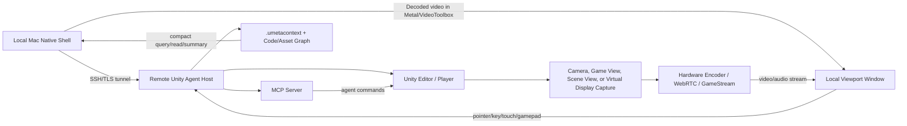

# Remote Unity Native Shell And Streaming

## Goal

Build a VS Code Remote SSH-style experience for Unity: the local Mac keeps a native-feeling app shell, while Unity processing, project files, asset indexing, builds, tests, and rendering run on a remote workstation or VM. The local app should feel like opening a local Unity tool, but the heavy work happens over the network.

The important distinction is that this is not only screen sharing. A useful Unity shell needs three planes working together:

- Control plane: commands, sessions, auth, project lifecycle, test/build/debug operations.
- Context plane: `.umetacontext`, asset graph, code graph, package state, scene/prefab summaries.
- Render/input plane: low-latency viewport video/audio plus pointer, key, touch, gamepad, and semantic Unity commands.

## VS Code Remote SSH Analogy

VS Code Remote Development keeps the client UI local while installing and running a VS Code Server on the remote OS. Microsoft documents that no source code needs to live on the local machine, because commands and extensions can run directly in the remote environment while the local VS Code client presents the UI. Remote SSH specifically connects to a remote machine or VM over SSH, installs VS Code Server, and lets terminals/debugging execute on the remote host.

Unity can use the same pattern, but needs an additional render plane:

| VS Code Remote SSH | Unity Remote Shell Equivalent |
| --- | --- |
| Local VS Code UI | Local macOS native shell, VS Code/Cursor extension, or lightweight desktop app |
| VS Code Server | Unity Agent Host with MCP server, Unity command bridge, context graph, render streamer |
| Remote extension host | Remote Unity tool host and project-owned agent commands |
| Remote terminal/debugger | Remote Unity batch/editor/player commands, tests, profiler, builds |
| File explorer over server APIs | `.umetacontext` summaries and explicit file/asset fetches |
| Port forwarding | Viewport stream, profiler stream, editor bridge, app preview ports |

The local app should not bulk-sync the Unity project by default. It should ask the remote host for compact context, run commands near the project, and fetch only narrow files/assets when needed.

## Current Prototype In This Repo

This branch now has a debug version of the render plane:

```bash
cd unity-cursor-toolkit
npm run dev:unity-viewport
```

That launches the bundled `CursorUnityTool` project in Unity batchmode, starts the Unity-side `viewport_stream` tool, and serves a local preview:

- `/` HTML preview
- `/viewport.mjpg` MJPEG stream
- `/latest.jpg` latest frame
- `/status.json` stream status

This is intentionally a v0 debug path. MJPEG is simple and inspectable, but it is not the final low-latency transport. It proves that a remote Unity host can keep producing frames while a local app consumes them.

## MVP: Workspace-Launched VDD Shell

The first remote shell MVP is launched from the repo workspace and targets a Windows VDD host without Moonlight:

```bash
# Creates remote_workspace/unity-shell.json from the checked-in example.
npm --prefix unity-cursor-toolkit run remote-shell -- init --manifest "$PWD/remote_workspace/unity-shell.json"

# Starts SSH tunnels, the remote Windows sidecar, and the native macOS shell.
npm --prefix unity-cursor-toolkit run remote-shell -- launch --manifest "$PWD/remote_workspace/unity-shell.json"
```

From VS Code or Cursor, use these workspace tasks:

- `Unity Shell: Init Manifest`
- `Unity Shell: Launch`
- `Unity Shell: Status`
- `Unity Shell: Stop`

The local sidecar reads `remote_workspace/unity-shell.json`, opens SSH tunnels, starts the remote PowerShell sidecar, and launches the bundled SwiftUI shell. The Windows sidecar launches a Unity Player build on the configured VDD monitor, captures the Unity window with FFmpeg `gdigrab`, serves `/viewport.mjpg`, and accepts `/input`, `/status.json`, and `/stop` on the control port.

The real manifest is ignored because it contains machine-specific hostnames and Windows paths. Keep `remote_workspace/unity-shell.example.json` as the shareable template.

## Target Architecture



## Remote Host Modes

| Mode | Use | Rendering Viability |
| --- | --- | --- |
| Unity Editor `-batchmode -executeMethod` | automation, commands, tests, controlled capture | viable if graphics are initialized; do not use `-nographics` for rendered capture |
| Unity Editor visible/headless service session | richer editor tooling and editor windows | viable but depends on display/session availability |
| Unity Player build | game/device viewport streaming | best fit for stable low-latency render streaming |
| Dedicated Server build | simulation/server authority | not a viewport source; Unity optimizes away render/audio work |
| Windows VM with virtual display driver | virtual monitor per shell/session | strong fit for Sunshine/Moonlight or custom desktop capture |
| macOS remote host | capture app/window/display via ScreenCaptureKit | viable for remote Mac editor shells, with macOS permissions |

Unity's command-line docs matter here: `-batchmode` is appropriate for automation, but `-nographics` skips graphics device initialization, so it is only valid for non-rendering workflows. Unity also documents batchmode coroutine limitations around `WaitForEndOfFrame`, so capture loops should use explicit camera/render texture capture or player builds rather than depending on editor Game View end-of-frame behavior.

## Transport Options

| Transport | Fit | Notes |
| --- | --- | --- |
| MJPEG over local HTTP | debug/prototype | easy to inspect; high bandwidth; no real input/audio protocol |
| Unity Render Streaming / WebRTC | Unity-native interactive stream | Unity provides video, audio, and remote-control APIs built on WebRTC; good v1 candidate |
| Sunshine + Moonlight | low-latency desktop/app streaming | proven game-streaming path with GPU encoding; pairs well with virtual displays |
| RDP RemoteApp / RAIL-like model | seamless remote app metaphor | useful conceptual reference for per-window local integration |
| Custom native stream over WebRTC/QUIC/RTP | long-term control | lets us combine low-latency media with Unity-specific metadata/input |

Recommended direction:

1. Keep MJPEG as the debug transport.
2. Add a WebRTC transport for Unity camera/render texture streams and input data channels.
3. Keep Sunshine/Moonlight as a parallel whole-display or virtual-display lane for experiments where host OS/app streaming is more important than Unity-specific semantics.
4. Build the local shell as a semantic controller, not just a video player.

## Native Shell Model

The local Mac cannot make a remote process become a true local AppKit process. What we can build is a native shell that makes the remote app feel local:

- Native macOS windows for each shell: Game, Scene, Device, Profiler, Console, Build Monitor.
- Hardware video decode via VideoToolbox.
- Rendering into a native Metal/MetalKit view.
- Local menu bar, shortcuts, clipboard, drag/drop, file dialogs, notifications.
- Remote command routing for anything that must happen inside Unity.
- Optional local projection of remote windows, similar in spirit to RemoteApp/RAIL.

The key product idea is semantic streaming: video is only one layer. The shell should know what it is looking at, because `.umetacontext`, scene/object IDs, agent commands, profiler state, and test/build status travel alongside the pixels.

## Virtual Display Direction

For Windows hosts, a virtual display driver is the cleanest way to give Unity/Sunshine a stable display without a physical monitor or dummy HDMI plug. Microsoft's Indirect Display Driver model explicitly supports remote display and virtual display scenarios, and VDD-style projects build on that model.

Viable experiments:

- One virtual monitor per Unity shell session.
- Sunshine captures that monitor and Moonlight receives it locally.
- Unity Agent Host still provides MCP/context/commands outside the video stream.
- Local shell embeds or coordinates the Moonlight client stream if possible; otherwise use it as a reference transport while building our own client.

This separates concerns: VDD/Sunshine solves "fast pixels from remote GPU"; Unity Agent Host solves "what those pixels mean and how agents act safely."

## Security And Trust Boundaries

- Default transport must be local-only or tunneled until auth is implemented.
- Remote command execution needs capability declarations, dry-run support, allowlists, and project-owned adapters.
- `.umetacontext` should exclude secrets and large/generated directories.
- Streams must not expose unauthenticated LAN ports by default.
- Pairing should bind a local client identity to a remote host identity.
- Input injection should be explicit and capability-gated.

## Milestones

### Phase 0: Debug Stream

- Keep the current MJPEG debug stream.
- Retain latest frame and stream status.
- Add smoke tests that prove frames decode and are nonblank.

### Phase 1: Remote Unity Agent Host

- Bootstrap remote host over SSH or tunnel.
- Start standalone MCP server on remote.
- Run `unity_context scan/query/read/summary` remotely.
- Launch Unity Editor in batchmode or controlled session.
- Route `game_command` to `editor`, `editorBatchmode`, `player`, or `auto`.

### Phase 2: Interactive Unity Viewport

- Add WebRTC transport using Unity Render Streaming or Unity WebRTC.
- Send input over a data channel.
- Keep project-owned viewport adapters as the first input layer.
- Use Unity Input System fallback only when the project has no adapter.

### Phase 3: Native Mac Shell

- Build a local shell window that decodes video with VideoToolbox and renders through MetalKit.
- Add command palette, logs, profiler panels, test/build panels, and contextual object selection.
- Use `.umetacontext` to avoid broad project fetches.

### Phase 4: Virtual Display / Sunshine Lane

- Prototype Windows host with IDD/VDD virtual monitor.
- Stream the monitor through Sunshine/Moonlight.
- Compare latency, fidelity, input behavior, multi-window support, and automation hooks against WebRTC.

### Phase 5: Remote App Semantics

- Add shell manifests: each remote Unity surface describes its title, stream, input capabilities, command set, object selection model, and lifecycle.
- Add per-shell permissions and isolated command scopes.
- Explore RAIL-like window metadata so remote Unity tools can appear as separate local windows.

## Open Questions

- Can we embed or coordinate a Moonlight stream cleanly inside our own native shell, or should Moonlight remain an external reference client?
- Should the first production stream be Unity Render Streaming/WebRTC or a custom transport using platform encoders?
- How much of Unity Editor's UI do we need to stream versus replacing with native panels backed by MCP/context data?
- What is the minimum remote host service: SSH plus Node MCP, or a packaged daemon with pairing and update management?
- How do we handle Unity licensing and single-editor project locks across remote sessions?
- What should be the shell abstraction: "remote project", "remote Unity session", "remote viewport", or "remote app"?

## References

- [VS Code Remote Development overview](https://code.visualstudio.com/docs/remote/remote-overview): local client with a remote server, no local source-code requirement, remote commands/extensions.
- [VS Code Remote SSH](https://code.visualstudio.com/docs/remote/ssh): SSH connection to remote machines/VMs, VS Code Server installation, remote terminals/debugging, port forwarding.
- [Unity Editor command-line arguments](https://docs.unity.cn/Manual/EditorCommandLineArguments.html): `-batchmode`, `-executeMethod`, `-logFile`, and the warning that `-nographics` does not initialize graphics.
- [Unity batchmode coroutine compatibility](https://docs.unity.cn/Manual/CLIBatchmodeCoroutines.html): `WaitForEndOfFrame` limitations in Editor batchmode.
- [Unity Dedicated Server build](https://docs.unity.cn/Manual/dedicated-server-build.html) and [Dedicated Server optimizations](https://docs.unity.cn/Manual/dedicated-server-optimizations.html): useful for server simulation, not rendered viewport streaming.
- [Unity Render Streaming 3.1](https://docs.unity.cn/Packages/com.unity.renderstreaming%403.1/manual/index.html): Unity package with video streaming, audio streaming, and remote control built on WebRTC.
- [Unity Render Streaming overview](https://docs.unity.cn/Packages/com.unity.renderstreaming%402.2/manual/overview.html): Unity + web server + browser signaling architecture and P2P UDP media flow.
- [Unity WebRTC package](https://docs.unity.cn/Packages/com.unity.webrtc%403.0/manual/index.html): lower-level Unity WebRTC API that Render Streaming builds on.
- [Sunshine docs](https://docs.lizardbyte.dev/projects/sunshine/master/index.html): self-hosted low-latency game streaming host for Moonlight with hardware/software encoding.
- [Moonlight](https://moonlight-stream.org/): open-source GameStream client with high-FPS/low-latency PC game streaming support.
- [Microsoft RDP Remote Programs / RAIL](https://learn.microsoft.com/en-us/openspecs/windows_protocols/ms-rdperp/485e6f6d-2401-4a9c-9330-46454f0c5aba): reference model for remote applications integrated locally.
- [Microsoft Indirect Display Driver model](https://learn.microsoft.com/en-us/windows-hardware/drivers/display/indirect-display-driver-model-overview): official virtual/remote display driver model for Windows.
- [Apple ScreenCaptureKit](https://developer.apple.com/documentation/screencapturekit/capturing_screen_content_in_macos): high-performance macOS display/window capture.
- [Apple VideoToolbox](https://developer.apple.com/documentation/videotoolbox): hardware-accelerated video encode/decode framework.
- [Apple MetalKit](https://developer.apple.com/documentation/metalkit/): native Metal view layer for presenting decoded frames in a Mac app.
