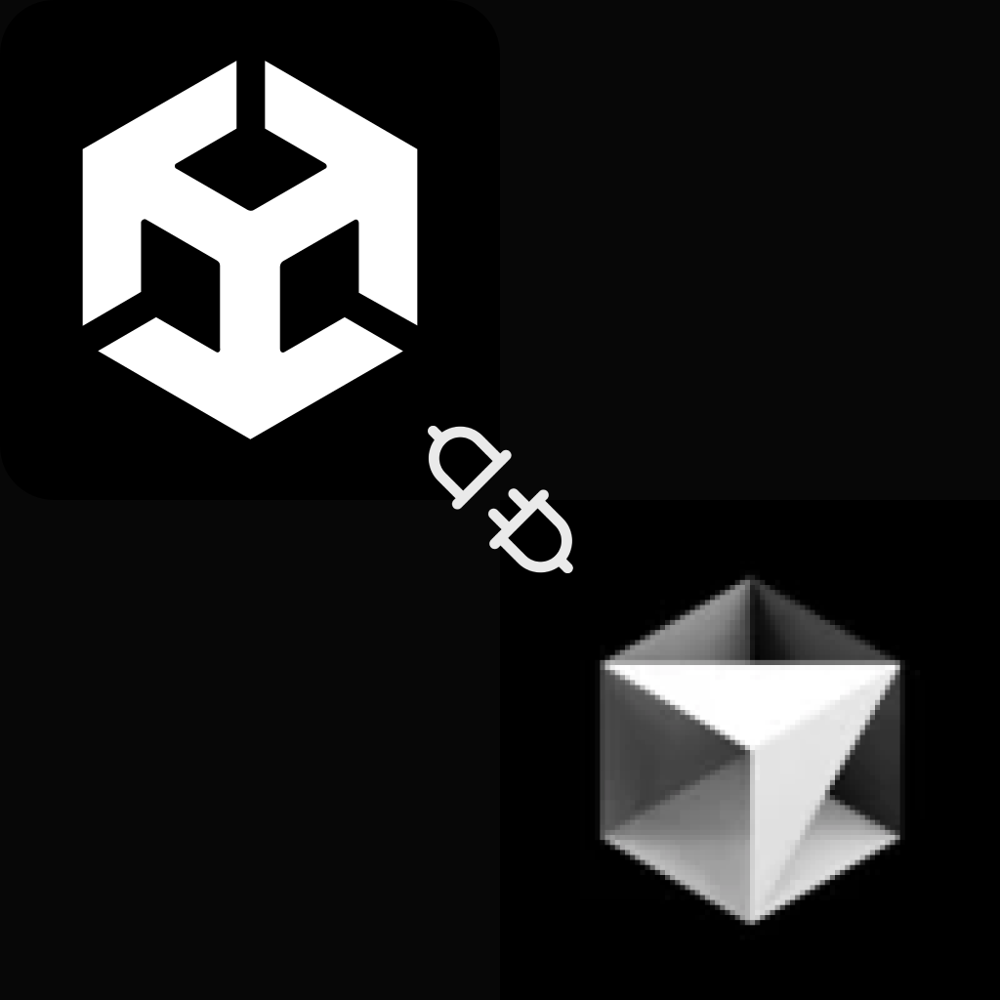

# Unity Cursor Toolkit

A VS Code/Cursor extension providing enhanced workflow features, including hot reload, for Unity projects. Edit your C# scripts and see changes reflected in Unity.

> **Disclaimer:** This extension is not affiliated with, endorsed by, or an official product of Unity Technologies. Unity and the Unity logo are trademarks or registered trademarks of Unity Technologies or its affiliates in the U.S. and elsewhere.

> **Developer's Note:** This extension is in active development. We welcome contributions, feedback, and feature requests.

## Features

- **Hot Reload** - Automatic refresh of Unity when scripts are modified (if Unity project is connected).
- **Simplified Connection Management** - Easy to connect, reload, and stop the connection to your Unity project via a status bar item and commands.
- **Project Detection** - Works with Unity projects in your workspace or allows selection of external folders.
- **Status Bar Integration** - A single status bar item provides context-aware actions.
- **Multi-Port Support** - Automatically finds available ports if the default is in use.

## Installation

### VS Code/Cursor Extension

- Install from VS Code Marketplace (once published): Search for "Unity Cursor Toolkit"
- Or, build and install the `.vsix` file from the [GitHub repository](https://github.com/rankupgames/unity-cursor-toolkit).

### Unity Script Installation

The necessary `HotReloadHandler.cs` script is automatically installed into your Unity project's `Assets/Editor` folder when you connect to a project for the first time using the "Unity: Start/Attach to Project" command or by clicking the status bar item when no project is attached.

## Usage

The extension provides a status bar item at the bottom right of your VS Code/Cursor window:

- **Initial State (`$(plug) Unity: Attach Project`)**: Click to select your Unity project and establish a connection. This will also install the required `HotReloadHandler.cs` script into your project if not already present.
- **Connecting State (`$(sync~spin) Unity: [ProjectName]`)**: Indicates the extension is attempting to connect.
- **Connected State (`$(circle-filled) Unity: [ProjectName]`)**: Shows the connected project and port (on hover). Hot reload is active. Clicking the status bar item in this state may offer to reload or stop the connection (behavior might vary based on context, primarily use commands for explicit actions when connected).
- **Disconnected State (`$(debug-disconnect) Unity: [ProjectName]`)**: Indicates a previously known project is not currently connected. Click to attempt to re-establish the connection.

### Commands

You can also use the Command Palette (Ctrl+Shift+P or Cmd+Shift+P) to access the following commands:

- **`Unity Toolkit: Start/Attach to Project`**: Initiates the process of selecting a Unity project (if not already known) and connects to it. Installs the necessary Unity script if it's the first time.
- **`Unity Toolkit: Reload Connection`**: If a project is attached, this command will stop the current connection (if active) and attempt to re-establish it. Useful if the connection was lost or to ensure a fresh link.
- **`Unity Toolkit: Stop Connection`**: Disconnects from the currently attached Unity project and deactivates hot reload features.

## Verification

When connected, check the Unity console for messages like "Unity Hot Reload server listening on port [port_number]" to confirm the `HotReloadHandler.cs` script is active in Unity.

## Troubleshooting

### No connection to Unity

- Ensure your Unity project is open in the Unity Editor.
- Verify the `HotReloadHandler.cs` script is present in `Assets/Editor` of your Unity project and has no compile errors.
- Check your firewall to ensure it's not blocking connections on the ports used (typically starting from 55500).
- Try the "Unity Toolkit: Reload Connection" command.
- Restart VS Code/Cursor and the Unity Editor.

### Script not working or errors in Unity Console

- Check the Unity console for any C# compilation errors or errors from `HotReloadHandler.cs`.
- Ensure there are no other tools or scripts in Unity conflicting with the port usage or script execution.
- Try stopping the connection via the command, then starting it again. This re-runs the script installation check.

## Known Issues

- Connection may be lost temporarily during script compilation in Unity.
- Hot reload doesn't apply to changes requiring a full domain reload in Unity (e.g., adding new public fields to MonoBehaviours that are already on GameObjects).

## License

MIT License - Copyright (c) 2025 Rank Up Games LLC

## Release Notes

### 0.1.306250522 (Current)

- **Fix (HotReloadHandler.cs)**: Resolved "SetInt_Internal can only be called from the main thread" error by deferring EditorPrefs.SetInt calls to the main thread from background listener threads.
- Ensured that both the source `HotReloadHandler.cs` in `unity-assets` and the in-project copy (e.g., `CursorUnityTool/Assets/Editor`) received this fix.

### 0.1.302250521

- **Major Command Refactor**: Introduced three core commands: `Start/Attach to Project`, `Reload Connection`, and `Stop Connection`.
- Simplified status bar interaction: Single item dynamically updates and triggers appropriate actions.
- Removed previous individual commands for enabling/disabling hot reload, force reload, etc.
- Status bar now shows connection port in tooltip and uses a green dot for active connection.
- Improved error handling for connection attempts to reduce pop-up spam.
- Updated README to reflect new workflow and commands.

### 0.1.20250320

- Updated GitHub repository links
- Added multi-port support to handle socket binding issues
- Added disclaimer about unofficial status
- Improved error handling
- Simplified documentation

### 0.1.0

- Initial release
- Hot reload functionality
- Unity script installation command
- Status bar controls
